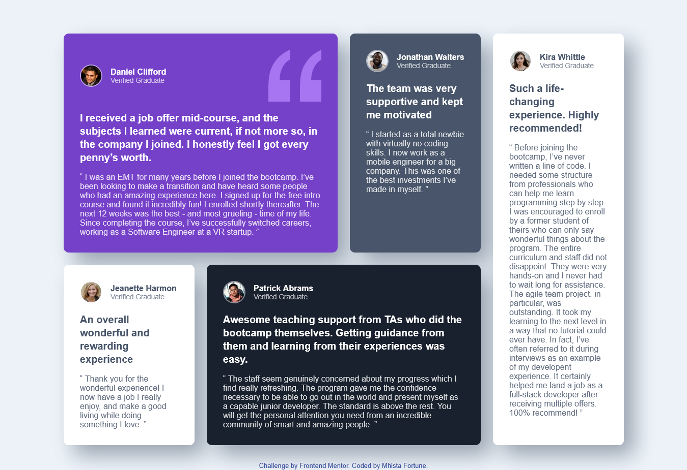
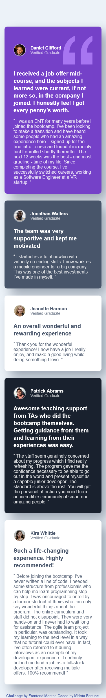

# Frontend Mentor - Testimonials Grid Section

This is a solution to the [Testimonials Grid Section challenge on Frontend Mentor](https://www.frontendmentor.io/challenges/testimonials-grid-section-Nnw6J7Un7). Users can view a responsive grid of testimonial cards, styled according to the provided design.

## Table of Contents

- [Overview](#overview)
- [The challenge](#the-challenge)
- [Screenshot](#screenshot)
- [Links](#links)
- [Built With](#built-with)
- [Features](#features)
- [What I learned](#what-i-learned)
- [How to Use](#how-to-use)
- [Author](#author)
- [Acknowledgments](#acknowledgments)

## Overview

This project displays a grid of testimonials from graduates, styled to match the provided design. The layout is fully responsive and includes interactive card hover effects.

### The Challenge

Users should be able to:

- View the optimal layout for the site depending on their device's screen size

## Screenshot




## Links

- [Solution on Frontend Mentor](#)
- [Live Site](https://testimonial-grid-project-ebon.vercel.app/)

## Built With

- Semantic HTML5 markup
- CSS Grid & Flexbox
- Custom CSS (no frameworks)
- Mobile-first workflow
- JavaScript (for card hover effect)
- [Barlow Semi Condensed](https://fonts.google.com/specimen/Barlow+Semi+Condensed) font

## Features

- Responsive grid layout for desktop and mobile
- Testimonial cards with unique colors and styles
- Interactive 3D card rotation effect on hover
- Accessible and semantic HTML structure

### What I learned

*** Component-Based Thinking: ***
Break down the UI into reusable components (testimonial cards) and style them individually.

*** Interactive Effects: ***
Enhance user experience by adding interactive effects (like 3D card rotation on hover) with CSS transitions and JavaScript.

## How to Use

1. Clone this repository:
   ```sh
   git clone https://github.com/Mhista-Fortune/Testimonial-Grid-Project/tree/main/testimonials-grid-section-main
   ```
2. Open `index.html` in your browser to view the project.
3. To customize, edit the HTML, CSS, or JS files as needed.

## Author

- Solution by [Mhista Fortune](#)
- [Frontend Mentor](https://www.frontendmentor.io/profile/Mhista-Fortune)

## Acknowledgments

- Challenge by [Frontend Mentor](https://www.frontendmentor.io?ref=challenge)
- Design inspiration and assets from Frontend Mentor

---
**Style Guide:**  
- Font: Barlow Semi Condensed, 500 & 600  
- Primary colors:  
  - Purple 50: hsl(260, 100%, 95%)  
  - Purple 300: hsl(264, 82%, 80%)  
  - Purple 500: hsl(263, 55%, 52%)  
- Neutral colors:  
  - White: hsl(0, 0%, 100%)  
  - Grey 100: hsl(214, 17%, 92%)  
  - Grey 200: hsl(0, 0%, 81%)  
  - Grey 400: hsl(224, 10%, 45%)  
  - Grey 500: hsl(217, 19%, 35%)  
  - Dark blue: hsl(219, 29%, 14%)  
  - Black: hsl(0, 0%, 7%)  
- Body font size: 13px
